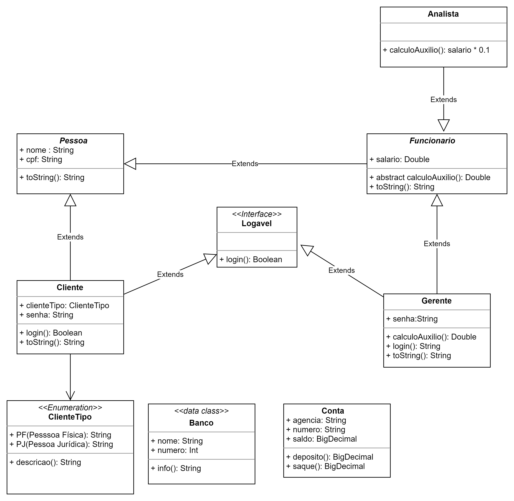
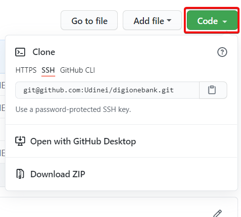
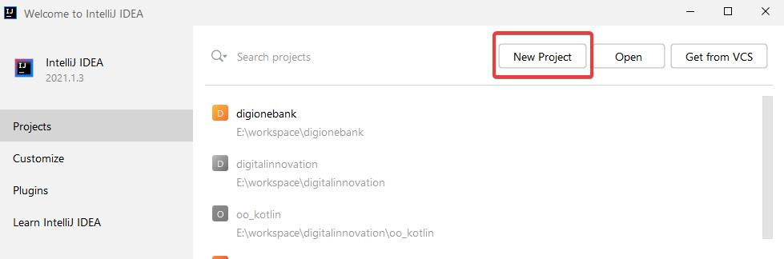
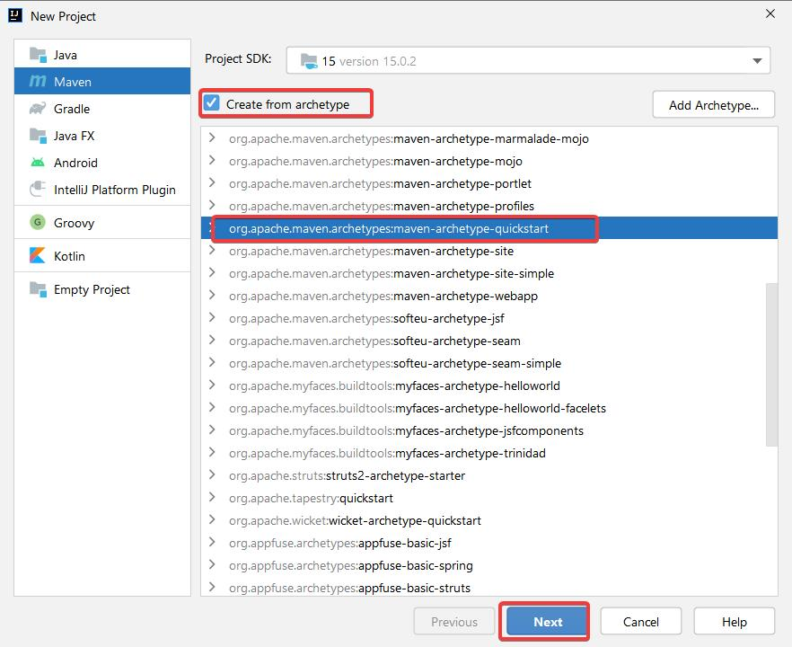
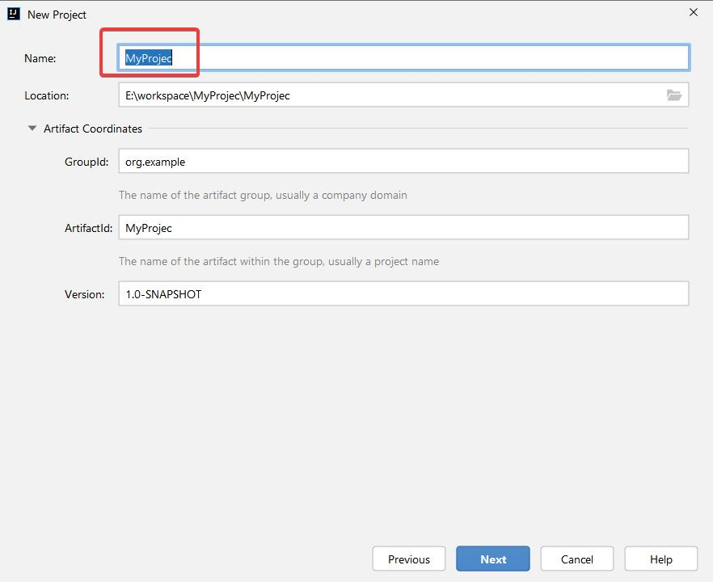
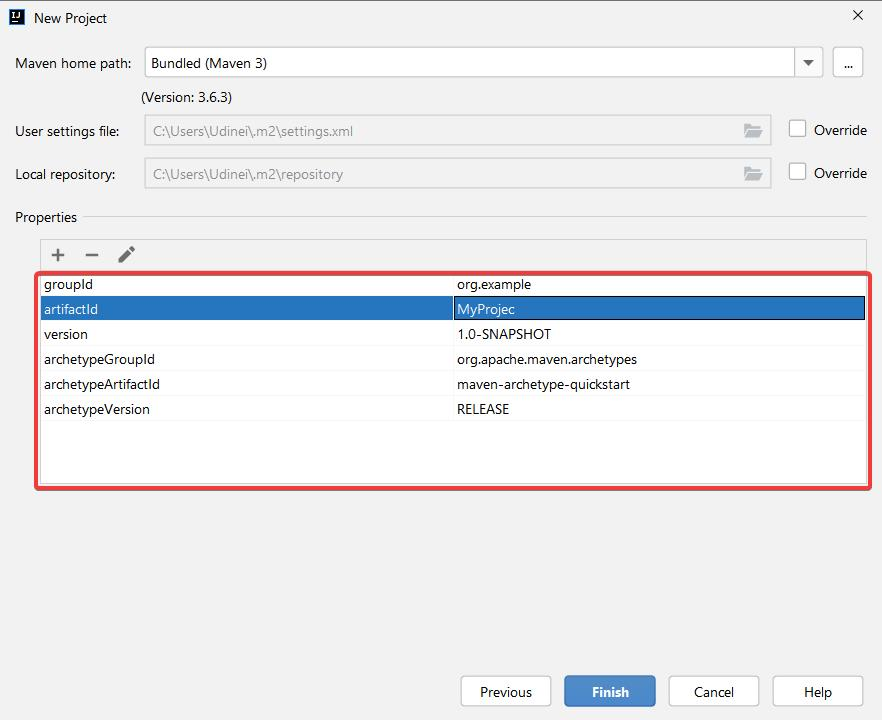
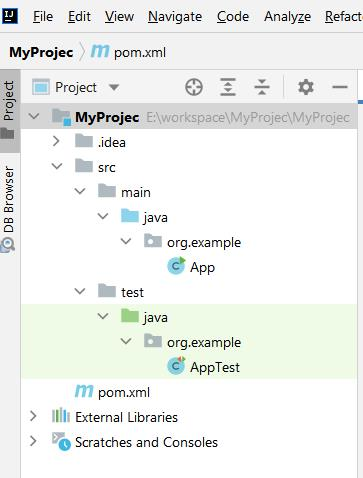
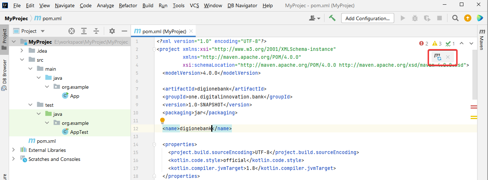
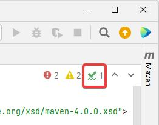
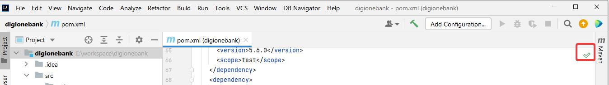

**PROJETO BÁSICO**

Diagrama de classes final

**AULA CONCEITO E PRÁTICAS SOBRE CLASSE**

Pelo fato de não ter achado o projeto zerado no github do professor,
e querer acompanhar as aulas codificando e fazendo os exercícios, eu resolvi criar esse projeto zerado,
e subir pra o github pra compartilhar com vocês, pra quem quiser acompanhar as aulas sem ter criar o projeto do zero.

E pra quem quiser criar o projeto do zero compartilho abaixo o passo a passo de
criação do projeto no intellij.

Você pode baixar o projeto zerado (básico) para acompanhar as aulas acessando o link do meu github https://github.com/Udinei/digionebank e clonando o projeto.

Link para clonar o projeto

ou você pode seguir os passos abaixo para criar um projeto zerado, igual o da estrutura do curso no Intellij.

**CRIAÇÃO DO PROJETO NO INTELLIJ**

**Criando o projeto**

Selecionando ao archetype “maven-archetype.quickstart”

Informando o nome e local do projeto no disco local

Editando e confirmando os dados projeto

O intellij irá criar o projeto baseado archetype do maven “maven-archetype.quickstart” com a seguinte estrutura

Copiar todo o conteúdo do arquivo pom.xml do projeto no endereço

https://raw.githubusercontent.com/jether2011/digitalinnovation/main/fundamentos_oo/pom.xml

e colar (sobrepor) todo conteúdo no pom.xml do projeto

Atualizando o projeto... clique no icone do plugin do Maven, assim automaticamente todo o projeto será atualizado com o novo conteúdo do pom.xml

Clique non icone para confirmar as alterações no projeto

Feche e abra o projeto novamente no intellij, verifique esta confirmada e validas as alterações realizadas no pom.xml do projeto

Projeto configurado!

Vlw! 